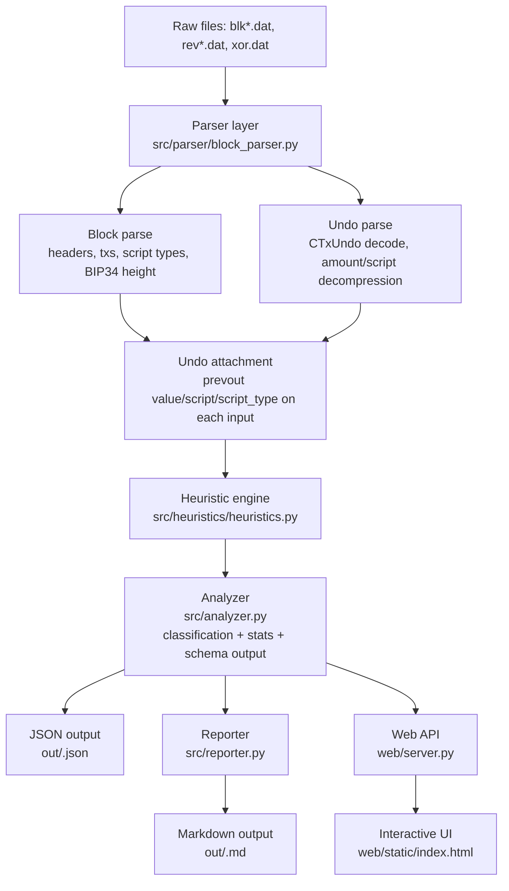

# Bitcoin Chain Analysis Engine - Approach

## 1) Project Goal

This project parses raw Bitcoin block files (`blk*.dat`, `rev*.dat`, `xor.dat`) and produces:

- machine-readable chain analysis JSON (`out/<blk_stem>.json`)
- human-readable Markdown reports (`out/<blk_stem>.md`)
- an interactive web visualizer for exploration and filtering

The system is fully offline. It does not depend on Bitcoin RPC or third-party APIs.

## 2) What Is Implemented

### Core deliverables

- CLI pipeline via `cli.sh` -> `src/cli.py`
- Parser for block and undo formats in `src/parser/block_parser.py`
- Heuristic engine in `src/heuristics/heuristics.py` (9 heuristics)
- Aggregation + classification engine in `src/analyzer.py`
- Markdown report generator in `src/reporter.py`
- Flask web API + UI in `web/server.py` and `web/static/index.html`

### Additional implemented feature

- Transaction summary + PSBT preview endpoint (`/api/tx-summary`) using `src/psbt/builder.py`

## 3) Architecture Diagram



## 4) Data Flow (Detailed)

### Stage A: Parse block file

`parse_blocks_from_file` scans for mainnet magic bytes, reads block payloads, parses:

- block header fields and displayed block hash
- all transactions (legacy + segwit)
- txid from non-witness serialization
- per-output script type (`p2pkh`, `p2sh`, `p2wpkh`, `p2wsh`, `p2tr`, `op_return`, `unknown`)
- BIP34 block height from coinbase script
- vsize and weight for fee-rate stats

If `xor.dat` exists, cyclic XOR de-obfuscation is applied first.

### Stage B: Parse undo file

`parse_undo_from_file` reads `rev*.dat` CBlockUndo records and decodes:

- compressed coin amounts (`_decompress_amount`)
- compressed scripts (`_decompress_script`)
- per-input `UndoCoin` metadata

It aligns undo records to blocks (checksum match first, positional fallback).

### Stage C: Attach prevout metadata

`attach_undo_data` enriches each non-coinbase input with:

- `prevout_value`
- `prevout_script`
- `prevout_script_type`

This is critical for exact fee-rate computation and better input-type inference.

### Stage D: Apply heuristics

`apply_all` executes all heuristics on each transaction and returns a structured result map.

### Stage E: Classify + aggregate

`analyze_file` and `analyze_block` generate:

- per-transaction classification
- per-block summary
- file-level aggregated summary
- heuristic trigger counts
- script-type distributions
- fee-rate statistics

To keep output practical for grading/performance, only `blocks[0]` contains full `transactions` detail; later blocks keep summaries.

### Stage F: Generate outputs

- JSON written to `out/<blk_stem>.json`
- Markdown report written to `out/<blk_stem>.md`

The web app reads these outputs and provides interactive exploration.

## 5) Module Map

```
src/
  cli.py                 # Orchestrates parse -> analyze -> write outputs
  parser/block_parser.py # blk/rev/xor parsing, script classification, undo attach
  heuristics/heuristics.py
                         # 9 detection heuristics + registry
  analyzer.py            # classification + fee/script/heuristic aggregations
  reporter.py            # Markdown report rendering
  psbt/builder.py        # Minimal PSBT generation and tx summary
web/
  server.py              # Flask API and static serving
  static/index.html      # Interactive analysis UI
```

## 6) Heuristics Implemented

All required heuristics are implemented, including mandatory `cioh` and `change_detection`.

| Heuristic ID | What it detects | Detection logic | Confidence approach | Main limitations |
|---|---|---|---|---|
| `cioh` | multi-input ownership assumption | `detected = (inputs > 1)` for non-coinbase tx | confidence scales by input count (`low/medium/high`) | false positives in CoinJoin/PayJoin-style behavior |
| `change_detection` | likely change output index | priority rules: (1) script-type match with dominant input type, (2) one non-round output among round outputs, (3) stricter 2-output value-ratio fallback | explicit `high/medium/low` by method strength | wallets may randomize output order/type; can mislabel payment as change |
| `coinjoin` | equal-output mixing pattern | at least 3 equal-value outputs, input count >= equal-output-count, and equal-output share guard | medium to high depending on symmetry strength | batched payouts can still look similar |
| `consolidation` | wallet UTXO merge | inputs >= 5 and outputs <= 2, with script-type coherence signal | `low/medium/high` based on input count + type coherence | may overlap with exchange internal flows |
| `address_reuse` | output script reuse | intra-tx reuse and cross-tx reuse within same block, restricted to standard spendable script templates | medium/high (higher for multiple or internal matches) | block-local scope only; no long-range clustering |
| `self_transfer` | internal wallet movement | strict same-type-family matching plus output-shape guard (single-output sweep or dominant+tiny side output) | medium/high under strict pattern | sender and receiver may still share script families |
| `peeling_chain` | peel-like split | exactly 2 outputs with stricter large/small ratio and dominant-output-share thresholds | medium/high for strong one-hop asymmetry | true peeling chain requires cross-transaction temporal linking |
| `op_return` | data-carrying outputs | detect `op_return` outputs; classify known payload prefixes (Omni/OpenTimestamps/Stacks/etc.) | high for opcode detection, medium for protocol attribution | unknown payload prefixes remain unclassified |
| `round_number_payment` | round-value payment cues | round-output detection uses stricter thresholds and suppresses ambiguous all-round multi-output txs | medium/high when exact BTC round values appear | some change outputs are also round amounts |

## 7) Transaction Classification Policy

Classification is deterministic and priority-based:

1. `coinjoin`
2. `consolidation` (with input threshold guard)
3. `self_transfer`
4. `batch_payment` (>=4 outputs + change detected)
5. `simple_payment` (requires non-trivial signal; `cioh` alone is not enough)
6. `unknown`

This design favors interpretability and reproducibility over black-box scoring.

## 8) Confidence Model

Each heuristic outputs `detected: bool` and confidence labels where applicable:

- `high`: strong structural signature with low ambiguity in local block context
- `medium`: plausible behavioral pattern with known overlaps
- `low`: weak single-transaction proxy for a multi-step pattern

Confidence is intentionally heuristic-local, not an overall probability score.

## 9) Web Visualizer Design

The web app is a thin analysis client over generated JSON:

- `/api/health` basic status endpoint
- `/api/blocks` lists available analyses
- `/api/blocks/<stem>` returns full file-level analysis
- `/api/search` filters tx rows by txid/classification/heuristic
- `/api/upload-analyze` supports async upload + analysis jobs
- `/api/tx-summary` returns tx-level summary and optional PSBT base64

UI features:

- file picker + block tabs
- classification and heuristic filters
- transaction table with expandable heuristic details
- script distribution and fee-rate visual summaries

## 10) Trade-offs and Design Decisions

### Accuracy vs throughput

- Undo parsing is more expensive but enables exact input-value based fee rates.
- Parsing and heuristics remain linear and deterministic over transaction stream.

### Output size vs detail

- Full tx-level rows are included only for first block in each file.
- Later blocks keep summaries to reduce file size and improve web responsiveness.

### Simplicity vs modeling depth

- Rule-based heuristics are transparent and easy to audit.
- No global entity graph clustering or machine-learning scorer is used.

### Robustness choices

- XOR key is optional (works with legacy/non-obfuscated fixtures).
- Undo alignment uses checksum matching with positional fallback.
- Heuristic execution is exception-safe (`detected: false` with error field if needed).

## 11) Known Limitations

- No script execution, signature validation, or mempool context.
- Address reuse is block-local, not chain-global.
- Peeling-chain detection is local-pattern only (no multi-hop linkage).
- Change detection can fail for privacy-hardened wallet behavior.
- No wallet fingerprinting by software/version.

## 12) Validation and Reproducibility

Typical run:

```bash
./setup.sh
./cli.sh --block fixtures/blk04330.dat fixtures/rev04330.dat fixtures/xor.dat
./web.sh
```

Outputs are deterministic for the same input files and code revision.

## 13) References

- Satoshi Nakamoto, *Bitcoin: A Peer-to-Peer Electronic Cash System* (2008)
- BIP34: Block v2, Height in Coinbase
- Bitcoin Core data structures and serialization formats (`blk*.dat`, `rev*.dat`, undo coin compression)
- BIP174: PSBT
- Meiklejohn et al., *A Fistful of Bitcoins* (2013)
- Public literature and engineering writeups on CoinJoin, change detection, and clustering heuristics
