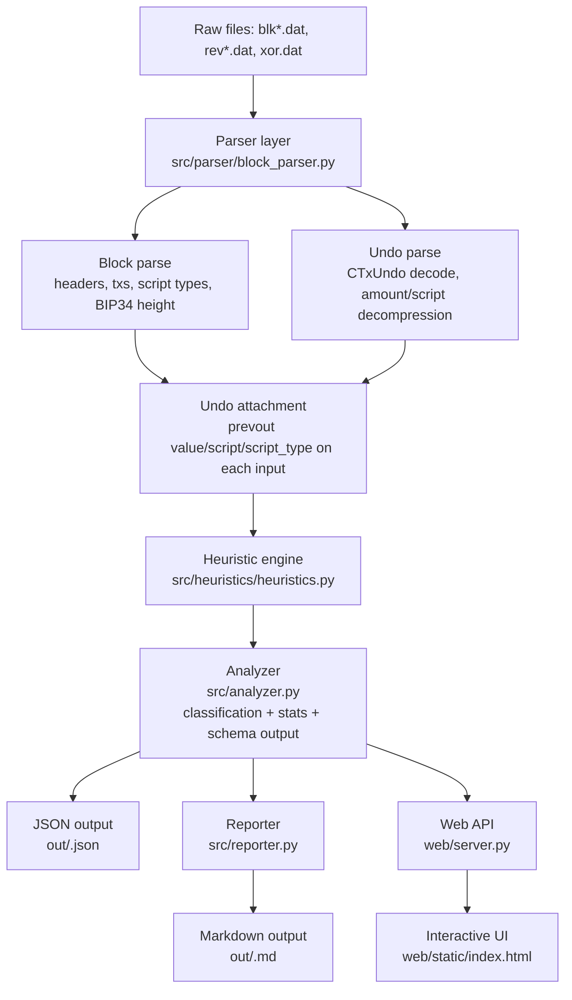

# HeuriChain: Bitcoin Chain Analysis Engine
https://heurichain.vercel.app/
HeuriChain is a comprehensive Bitcoin blockchain analysis tool that parses raw Bitcoin block files (`blk*.dat`, `rev*.dat`, `xor.dat`) and applies advanced heuristics to detect transaction patterns and behaviors. It provides both command-line and web interfaces for analyzing blockchain data offline without requiring Bitcoin RPC or third-party APIs.

## Features

- **Raw Block Parsing**: Parses Bitcoin Core's raw block files including undo data and XOR de-obfuscation
- **Heuristic Analysis**: Applies 9+ sophisticated heuristics to detect transaction patterns
- **Transaction Classification**: Automatically classifies transactions based on detected patterns
- **Statistical Analysis**: Computes comprehensive statistics on fees, script types, and block metrics
- **Multiple Output Formats**:
  - Machine-readable JSON reports
  - Human-readable Markdown reports
  - Interactive web visualizer
- **PSBT Preview**: Transaction summary and PSBT (Partially Signed Bitcoin Transaction) builder
- **Offline Operation**: No internet connection required after initial setup

## Architecture



## Installation

### Prerequisites

- Python 3.8+
- Bash shell (for scripts)

### Setup

1. Clone the repository:
```bash
git clone <repository-url>
cd heurichain
```

2. Run the setup script:
```bash
./setup.sh
```

This will:
- Install Python dependencies from `requirements.txt`
- Decompress any fixture files if present

## Usage

### Command Line Interface

Analyze block files using the CLI:

```bash
# Basic usage
./cli.sh --block path/to/blk00000.dat path/to/rev00000.dat path/to/xor00000.dat

# The CLI outputs JSON results to stdout
```

**Parameters:**
- `blk*.dat`: Main block data file
- `rev*.dat`: Undo data file (for transaction reversal info)
- `xor*.dat`: XOR de-obfuscation file (optional, for older Bitcoin Core versions)

### Web Interface

Start the web visualizer:

```bash
./web.sh
```

The web interface will be available at `http://127.0.0.1:3000` (or the port specified by `PORT` environment variable).

**Features:**
- Upload and analyze block files
- Interactive transaction exploration
- Filtering and search capabilities
- Visual charts and statistics
- PSBT transaction preview

### API Endpoints

The web server provides several API endpoints:

- `GET /api/sources`: List available analysis sources
- `POST /api/upload`: Upload block files for analysis
- `GET /api/analysis/<source>`: Get analysis results
- `GET /api/tx-summary/<txid>`: Get transaction summary and PSBT

## Output Formats

### JSON Output (`out/<blk_stem>.json`)

Contains structured analysis data including:
- Block summaries with transaction counts and statistics
- Per-transaction classifications and heuristic results
- Fee rate distributions and script type breakdowns
- Heuristic trigger counts and confidence levels

### Markdown Reports (`out/<blk_stem>.md`)

Human-readable reports with:
- Executive summary
- Block-by-block analysis
- Transaction classifications
- Statistical charts and tables
- Detected patterns and anomalies

## Heuristics

HeuriChain implements multiple heuristics to detect various transaction patterns:

- **Round Amount Detection**: Identifies transactions with suspiciously round BTC amounts
- **Dust Threshold Analysis**: Detects outputs below dust thresholds
- **Script Type Analysis**: Analyzes input/output script patterns
- **Fee Rate Anomalies**: Identifies unusual fee rates
- **And more...** (see `src/heuristics/heuristics.py` for complete list)

Each heuristic provides confidence levels (high/medium/low) for detected patterns.

## Grading Suite

The project includes a comprehensive grading suite for evaluation:

```bash
./grade.sh
```

This runs automated tests for:
- Analysis accuracy
- Report generation
- Documentation completeness

## Project Structure

```
heurichain/
├── src/
│   ├── cli.py                 # Command-line interface
│   ├── analyzer.py            # Core analysis engine
│   ├── reporter.py            # Report generation
│   ├── parser/
│   │   └── block_parser.py    # Bitcoin block parsing
│   ├── heuristics/
│   │   └── heuristics.py      # Heuristic definitions
│   ├── psbt/
│   │   └── builder.py         # PSBT construction
│   └── common/
│       └── primitives.py      # Common utilities
├── web/
│   ├── server.py              # Flask web server
│   └── static/
│       └── index.html         # Web interface
├── grader/                    # Grading suite
├── fixtures/                  # Test data
├── uploads/                   # Uploaded files
├── out/                       # Analysis outputs
├── cli.sh                     # CLI runner script
├── web.sh                     # Web server runner
├── setup.sh                   # Setup script
├── grade.sh                   # Grading runner
└── requirements.txt           # Python dependencies
```

## Dependencies

- Flask 3.1.0 (web interface)
- Python standard library modules

## Development

### Running Tests

```bash
# Run the grading suite
./grade.sh
```

### Adding New Heuristics

1. Define your heuristic function in `src/heuristics/heuristics.py`
2. Add it to the `HEURISTIC_IDS` list
3. Update the analysis logic in `src/analyzer.py` if needed

### Web Interface Development

The web interface is built with vanilla JavaScript and CSS. Modify `web/static/index.html` for UI changes.

## License

[Add license information here]

## Contributing

[Add contribution guidelines here]

## Demo

Watch the project demo: https://youtu.be/oBcFoqOntVI?si=Sln9SKeRxWMthiNB
